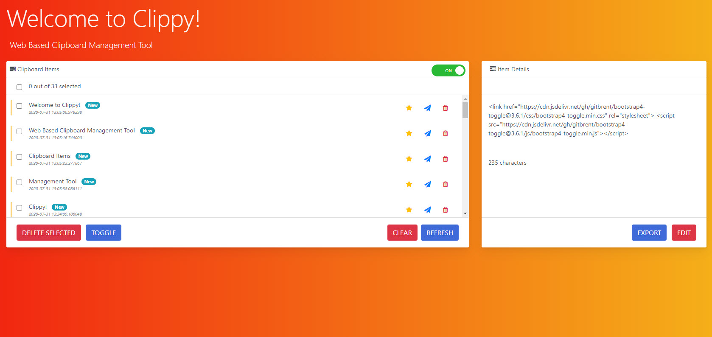

## About Clippy

`Clippy` is a web-based clipboard manager. 

### Built With
* [Python](https://www.python.org/)
* [Flask](https://palletsprojects.com/p/flask/)
* [Bootstrap](https://getbootstrap.com)
* [JQuery](https://jquery.com)

### Features
* Saving previously copied text
* Display text details (time/date, length, source)
* Deleting saved text (individual and bulk)
* Toggle saving/listening
* Click to copy to clipboard

### Features to Come
* Sharing/Exporting text
* Favoriting text
* Editing text
* Differentiating Items via Tags (New, Copied, etc.)
* Search items

## License
Distributed under the MIT License. See `LICENSE` for more information.

## Acknowledgements
* [Icons8](https://icons8.com)
* [Font Awesome](https://fontawesome.com)
* [Choose an Open Source License](https://choosealicense.com)
